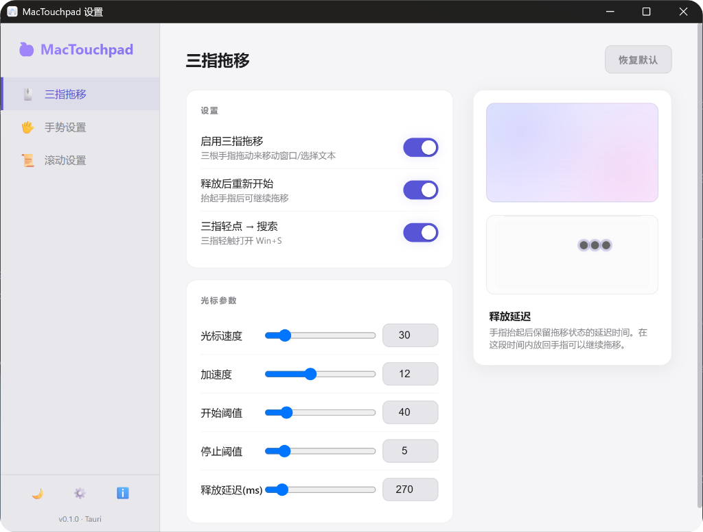
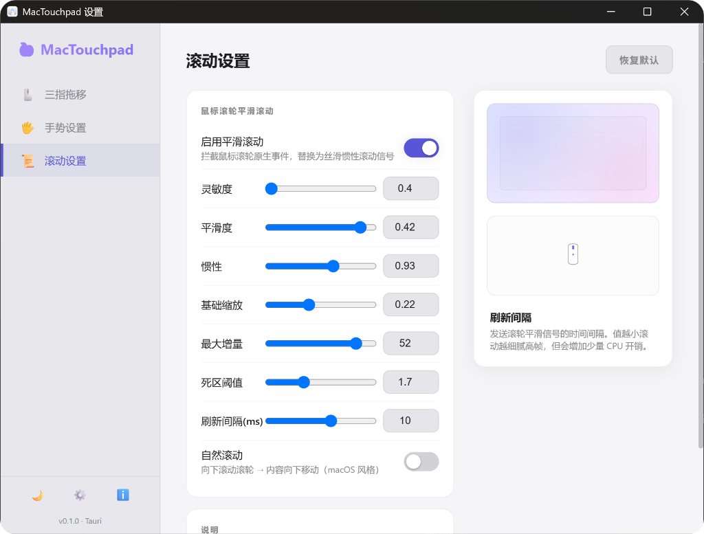

# MacTouchpad

### macOS-like Trackpad Gestures and Mouse Scroll Smoothing Manager for Windows

[](https://github.com/xiaolu12-up/Mac-touchpad/releases)
[](https://github.com/xiaolu12-up/Mac-touchpad/releases)
[](https://tauri.app/)
[](https://github.com/xiaolu12-up/Mac-touchpad/releases)

[🌐 Official Website (Reserved)](https://mactouchpad.io) | **English** | [中文](./README.md) | [Changelog](./CHANGELOG.md)

---

## ❓ Why MacTouchpad?

Modern multi-tasking workflow relies heavily on touchpad gestures and scroll wheels. However, on Windows:
1. **Limited Gesture Options**: Native Windows gestures are basic, lacking popular macOS gestures like **three-finger drag** (moving windows/selecting text) or **edge slide volume adjustment**.
2. **Clunky Scroll Wheels**: Scrolling with external clicky mouse wheels is segment-based, stiff, and has no physics decay. Most generic "smooth scroll" software intercepts scroll events indiscriminately, interfering with the touchpad's high-precision native inertia scroll and causing lags or conflicts.

**MacTouchpad provides the perfect solution**. Utilizing low-level hooks and raw HID reports, it injects macOS-level gestures into Windows and runs a custom **dual-velocity smooth scroll engine** for external mouse wheels. It selectively intercepts clicky mouse scroll events while bypassing touchpad native scroll inputs and inertia decays entirely, maintaining a buttery-smooth scrolling experience.

---

## 🚀 Key Features

- **Three-Finger Drag** — Drag windows or select text using three fingers on your touchpad. Supports custom release delay to prevent accidental drops at touchpad borders.
- **Custom Multi-Finger Gestures** — Four-finger swipe up (Task View), down (Start Menu), left/right (virtual desktop switching), pinch & spread (Show Desktop).
- **Left-Edge Volume Adjustment** — Slide up or down along the leftmost edge of the touchpad to control system volume.
- **Mouse Smooth Scroll** — Intercepts external clicky mouse wheel events and maps them to a dual-velocity damping model for smooth inertia scrolling.
- **Smart Device Bypass** — **Advanced dual-bypass algorithm**. Utilizes delta modulo (120) and a touchpad touch safety timer (1000ms) to ensure touchpad scroll and native inertia are never intercepted. High-precision free-spinning wheels are also passed through natively.
- **Modern Control Panel** — Native app built with Tauri 2. Supports Dark/Light/System theme toggles and features macOS-style vector finger animation guides.

---

## 💻 Screenshots

| Main UI - Three-Finger Drag Settings | Scroll Settings |
| :---: | :---: |
|  |  |

---

## 📥 Download and Install

### System Requirements
*   **Windows**: Windows 10 or later (64-bit).

### Download
Get the installer from the [Releases page](https://github.com/xiaolu12-up/Mac-touchpad/releases):
*   **Installer**: `MacTouchpad-v{version}-Windows.msi`
*   **Portable Zip**: `MacTouchpad-v{version}-Windows-Portable.zip`

---

## 🛠️ Development and Build

### Local Development
1. Ensure Rust (Edition 2021) and Windows C++ Build Tools are installed.
2. Clone the repo and run:
   ```bash
   git clone https://github.com/xiaolu12-up/Mac-touchpad.git
   cd mac-touchpad
   cargo run --manifest-path src-tauri/Cargo.toml
   ```

### Compile & Build
```bash
cargo tauri build
```

---

## ⚖️ License

This project is licensed under the [MIT License](LICENSE).
