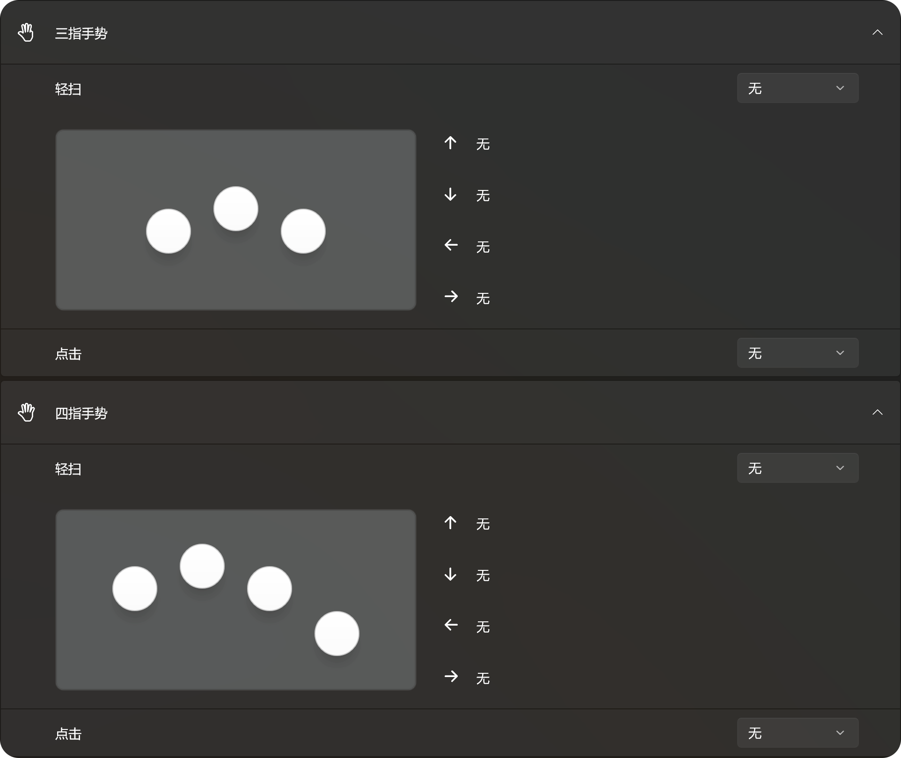
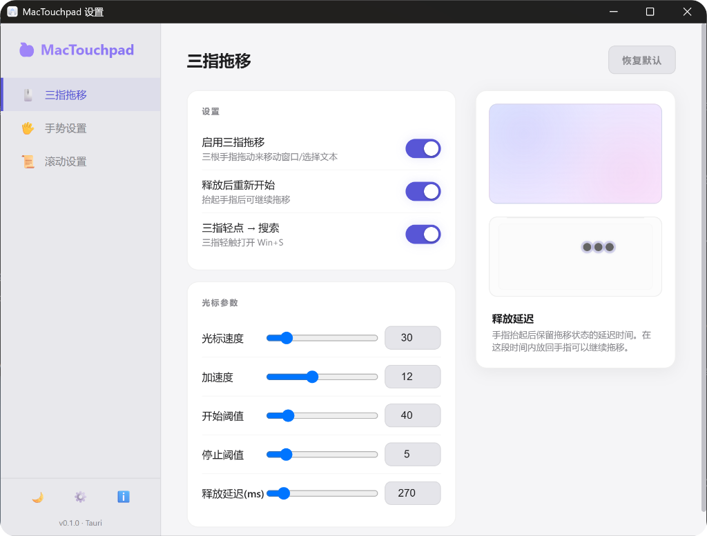
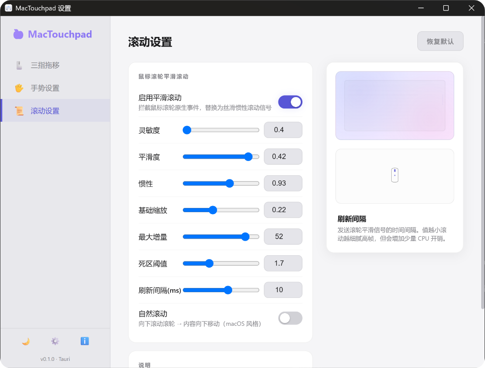

# MacTouchpad

### macOS-like Precision Touchpad Gestures & Mouse Scroll Smoothing Manager for Windows

[](https://github.com/xiaolu12-up/Mac-touchpad/releases)
[](https://github.com/xiaolu12-up/Mac-touchpad/releases)
[](https://tauri.app/)
[](LICENSE)
[](https://github.com/xiaolu12-up/Mac-touchpad/releases)

[English](./README_EN.md) | [中文](./README.md) | [Changelog](./CHANGELOG.md)

---

## ❓ Why MacTouchpad?

Modern productivity workflows rely heavily on natural trackpad gestures and smooth document navigation. However, on Windows:
1. **Limited Built-in Gestures**: Windows native precision touchpad gesture customization is rudimentary, lacking highly requested macOS gestures like **three-finger drag** (moving windows/selecting text) and **edge-sliding volume control**.
2. **Stiff Mouse Wheel Scrolling**: Traditional mouse wheels scroll in coarse, abrupt increments (120 units per notch) without momentum. Most generic "smooth scroll" utilities intercept all wheel events globally, which **severely degrades and interferes with native precision touchpad scrolling and inertia decay**, introducing noticeable lag and stutter.

**MacTouchpad provides an elegant, zero-compromise solution**. By leveraging low-level Win32 hooks and raw HID packet inspection, it brings authentic macOS-style multi-finger gestures to Windows, combined with a **dual-velocity physics-based smooth scrolling engine**. It intelligently intercepts only physical notched mouse wheel events while completely bypassing touchpad touch states and native inertia tails.

---

## 🚀 Detailed Features

### 1. Touchpad Gestures

| Gesture | How to Perform | Default Action | Details |
| :--- | :--- | :--- | :--- |
| **Three-Finger Drag** | Slide three fingers across the touchpad surface | Drag window / Select text | Emulates holding down the left mouse button. Features a **Release Delay** (200~600ms) allowing you to reposition your fingers at the edge without dropping the window. |
| **Three-Finger Tap** | Quick tap with three fingers | Windows Search | Triggers an immediate tap action. Fully customizable to Search, Middle Click, or any custom key combination. |
| **Four-Finger Swipe** | Swipe four fingers in any cardinal direction | Up: Task View<br>Down: Start Menu<br>Left/Right: Switch Desktops/Apps | High-precision vector recognition for responsive workspace switching. |
| **Four-Finger Pinch / Spread** | Pinch or spread thumb against three fingers | Spread: Show Desktop<br>Pinch: Start Menu | macOS Launchpad and Show Desktop equivalent gestures. |
| **Left-Edge Volume Adjustment** | **Place one finger on left edge, one in center, lift center finger and slide** | Adjust system volume | Smart anti-misclick mechanism. Slide vertically along the leftmost edge to smoothly control system volume with Windows on-screen OSD feedback. |

> [!IMPORTANT]
> ⚠️ **Configuration Note**:
> To prevent conflicts with Windows built-in gestures, navigate to **Windows Settings → Bluetooth & Devices → Touchpad**, and set both "Three-finger gestures" and "Four-finger gestures" to **"Nothing" / "None"**.
>
> 

---

### 2. Mouse Smooth Scrolling Engine

Engineered specifically for physical stepped (notched) mouse wheels:

- **Dual-Velocity Damping Model**: Dynamically scales acceleration based on scroll frequency and wheel delta. Slow scrolling offers pixel-accurate precision, while quick flicks produce long, fluid inertia glides.
- **Smart Dual-Bypass Algorithm**:
  - **Delta Modulo Check**: Identifies standard notched mouse wheel steps (120-unit increments).
  - **Touch Safety Timer (1000ms)**: Bypasses smoothing whenever touchpad touch or inertia decay is active.
  - **Free-spinning Wheels**: High-precision free-wheeling mice (e.g. Logitech MX Master) are automatically passed through untouched.
- **Granular Physics Tuning**:
  - Speed, Smoothness, Deceleration, Base Scale, Max Delta, Deadzone, and Natural Scrolling toggles.

---

### 3. Application Execution Policies

Control when and where smooth scrolling applies:

- 🎮 **Fullscreen Auto-Disable**: Automatically suspends scroll smoothing in full-screen games or video players to prevent unintended weapon-switching or camera zoom inertia.
- 🌐 **Browser-Only Mode**: Activates smooth scrolling exclusively in supported web browsers (Chrome, Edge, Firefox, Brave, Arc, Opera, etc.).
- 📋 **Process Blacklist & Whitelist Management**:
  - Built-in executable inspector with automatic icon and version extraction.
  - Granular application-level filtering based on executable paths and file names.

---

### 4. Hardware Diagnostics & Debug Mode

Built-in diagnostics subsystem for troubleshooting across diverse touchpad hardware (Synaptics, ELAN, Goodix, ALPS, etc.):

- **Activation**: Go to the **About** page and **tap the version number 5 times** within 2 seconds.
- **Zero Overhead**: When closed, the debug hook exits immediately via an atomic instruction with zero memory allocation or disk I/O.
- **Hardware Dashboard**:
  - Displays hardware detection state, Vendor ID, Product ID, logical coordinate boundaries (`X/Y Range`), and process elevation status.
  - **Live Contact Monitor**: Inspect real-time finger counts and individual `(id, x, y)` coordinates.
- **📄 One-Click Log File Export**:
  - Export comprehensive hardware reports and raw contact event streams to `%APPDATA%\MacTouchpad\logs\` with automated Explorer selection.

---

## 💻 Screenshots

| Three-Finger Drag Settings | Scroll & Smoothing Policies |
| :---: | :---: |
|  |  |

---

## 📥 Download & Installation

### Requirements
*   **OS**: Windows 10 / Windows 11 (64-bit).
*   **Hardware**: Touchpad supporting Windows Precision Touchpad (PTP) specifications.

### Download Links
Download the latest installer build from [GitHub Releases](https://github.com/xiaolu12-up/Mac-touchpad/releases):
*   **Installer (`.exe` / `.msi`)**: Includes automated WebView2 checking and multilingual NSIS setup.

---

## ⚙️ Configuration & Autostart Details

- **Config Path**: `%APPDATA%\MacTouchpad\config.json`
- **Log Path**: `%APPDATA%\MacTouchpad\logs\`
- **Silent Elevated Autostart**:
  - MacTouchpad registers an elevated startup task via the Windows **Task Scheduler (`schtasks.exe`)**;
  - Launches silently in the background on system logon (with `--autostart`), **bypassing repetitive Windows UAC prompts**.

---

## 🛠️ Local Development & Build

### Architecture Overview
```text
mac-touchpad/
├── crates/
│   └── core/          # Gesture recognition, low-level hooks & PTP packet reassembly (Rust)
├── src-tauri/
│   ├── src/           # Tauri 2 backend, IPC command dispatch & tray icon management
│   ├── nsis/          # NSIS installer localization headers
│   └── tauri.conf.json# Tauri 2 configuration manifest
└── ui/
    └── index.html     # Single-file responsive interface (HTML5 / CSS3 / Vanilla JS)
```

### Build Commands
```bash
# 1. Clone repository
git clone https://github.com/xiaolu12-up/Mac-touchpad.git
cd mac-touchpad

# 2. Run unit test suite
cargo test -p mac-touchpad-core

# 3. Launch debug development instance
cargo run --manifest-path src-tauri/Cargo.toml

# 4. Compile release installer bundle
cargo tauri build
```

---

## ⚖️ License

Distributed under the [MIT License](LICENSE).
